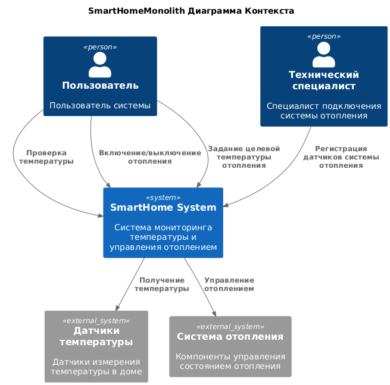
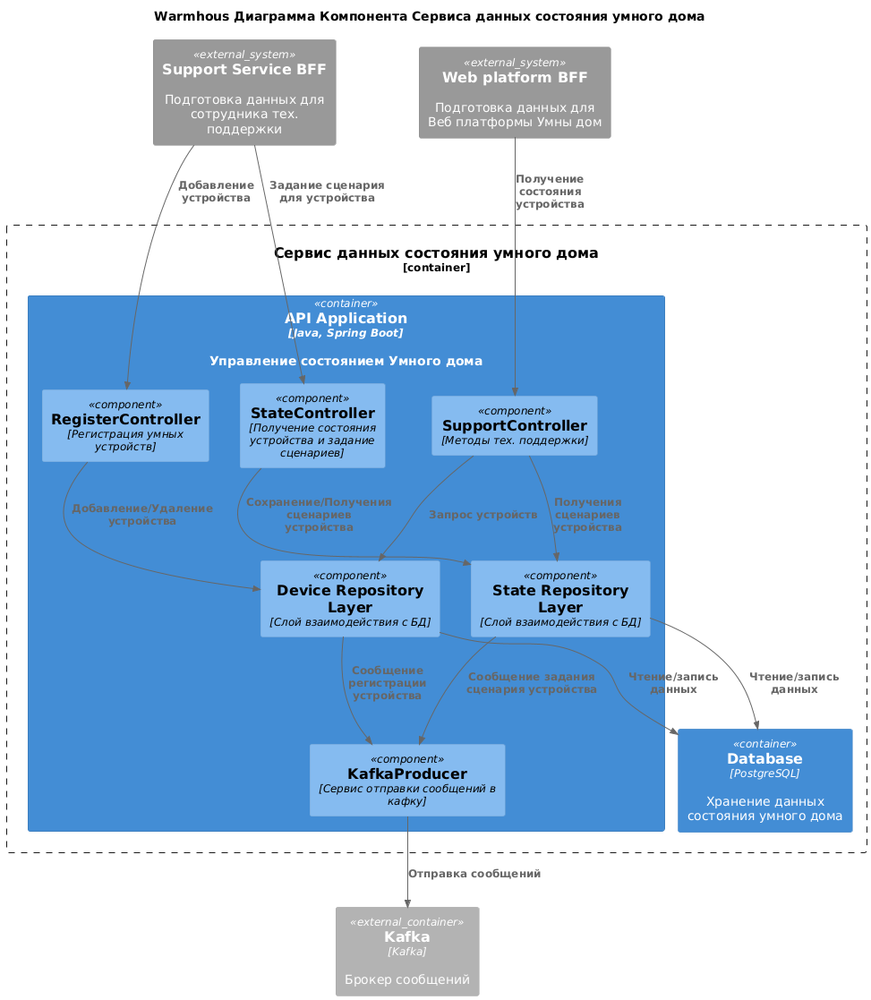

# Project_template

Тип: Материал
Родитель: Описание проекта для 11 когорты (https://www.notion.so/11-03abbbbc8bcb49ed9b85c9b6d1174056?pvs=21)

Это шаблон для решения проектной работы. Структура этого файла повторяет структуру заданий. Заполняйте его по мере работы над решением.

# Задание 1. Анализ и планирование

<aside>
💡

Чтобы составить документ с описанием текущей архитектуры приложения, можно часть информации взять из описания компани и условия задания. Это нормально.

</aside>

### 1. Описание функциональности монолитного приложения

**Управление отоплением:**

- Пользователи могут удалённо включать/выключать отопление в своих домах.
- Пользователи могут задать температуру отопления в доме.
- Система поддерживает получение данных о температуре с датчиков, установленных в домах.
- Система поддерживает автоматическое поддержание заданной температуры в доме.

**Мониторинг температуры:**

- Пользователи могут просматривать текущую температуру в своих домах.
- Система поддерживает получение данных о температуре от датчиков установленных в доме.

### 2. Анализ архитектуры монолитного приложения

- Архитектура приложения представляет из себя монолит.
- Система написана на языке Java.
- Данные хранятся в СУБД Postgres.
- Взаимодействие системы синхронное, все управление идет от сервера к датчику.
- Данные системы получаются через запрос от сервера к датчику.
- Подключение датчиков к системе осуществляется через выезд специалистов.

### 3. Определение доменов и границы контекстов

- Домен: управление отоплением
  - Поддомен: управление системами отопления
    - Контекст: получение информации о системе отопления
    - Контекст: включение/выключение системы отопления
    - Контекст: установка целевой температуры

- Домен: мониторинг температуры
  - Поддомен: мониторинг датчиков температуры
    - Контекст: получение текущей температуры
    - Контекст: получение и хранение данных с датчиков

### **4. Проблемы монолитного решения**

- Высокий риск ошибок. Изменения в части мониторинга температуры могут непредсказуемо влиять на часть управления отоплением. Из-за этого вырастает вероятность возникновения ошибок и компании приходится тратить дополнительные ресурсы на тестирование.
- Длительные циклы разработки и развёртывания. При каждом изменении приходится тестировать всё приложение целиком. Это замедляет выпуск новых функций.
- Трудно масштабировать отдельные компоненты системы. Например, с ростом числа клиентов будет возрастать нагрузка на части системы, отвечающие за мониторинг данных датчиков, что в свою очередь повлияет на части системы отвечающие за состояние дома. С монолитной архитектурой не получится масштабировать только эту часть — придётся масштабировать приложение целиком.
- Трудно внедрять новые компоненты системы. Для реализации поддержки новых типов датчиков и устройств управления (например автоматические ворота), необходимо дорабатывать приложение целиком, что может повлиять на другие части системы и потребует дополнительных ресурсов на тестирование.

### 5. Визуализация контекста системы — диаграмма С4

[Context.puml](diagrams/Context.puml)

# Задание 2. Проектирование микросервисной архитектуры

**Диаграмма контейнеров (Containers)**

[Containers.puml](diagrams/Containers.puml)

**Диаграмма компонентов (Components)**

[Component_IoTService.puml](diagrams/Component_IoTService.puml)

**Диаграмма кода (Code)**

[Code_IoTService.puml](diagrams/Code_IoTService.puml)

# Задание 3. Разработка ER-диаграммы

Добавьте сюда ER-диаграмму. Она должна отражать ключевые сущности системы, их атрибуты и тип связей между ними.

Четвёртое задание — дополнительное. Его можно сделать по желанию. Чтобы ревьюер быстрее проверил ваше решение, укажите, сделали вы это задание или нет. Для этого оставьте нужный эмодзи около заголовка задания:

✅ — вы выполнили задание.

❌ — вы пропустили задание.

# ✅ ❌ Задание 4. Создание и документирование API

### 1. Тип API

Укажите, какой тип API вы будете использовать для взаимодействия микросервисов. Объясните своё решение.

### 2. Документация API

Здесь приложите ссылки на документацию API для микросервисов, которые вы спроектировали в первой части проектной работы. Для документирования используйте Swagger/OpenAPI или AsyncAPI.